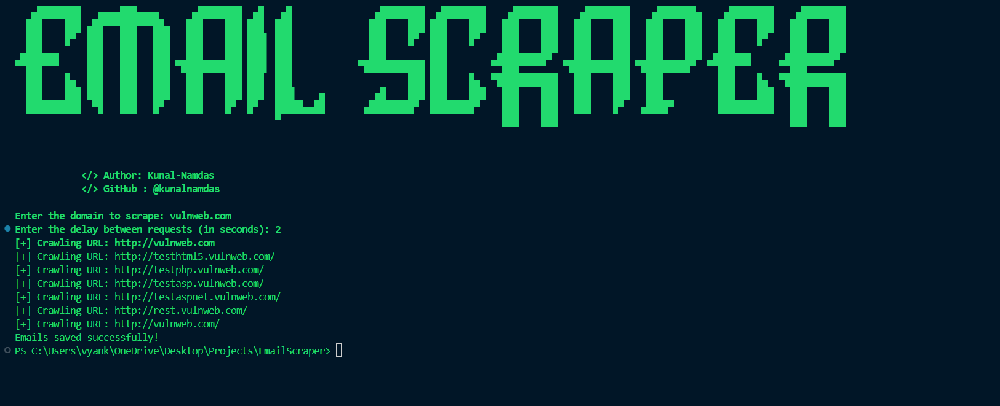
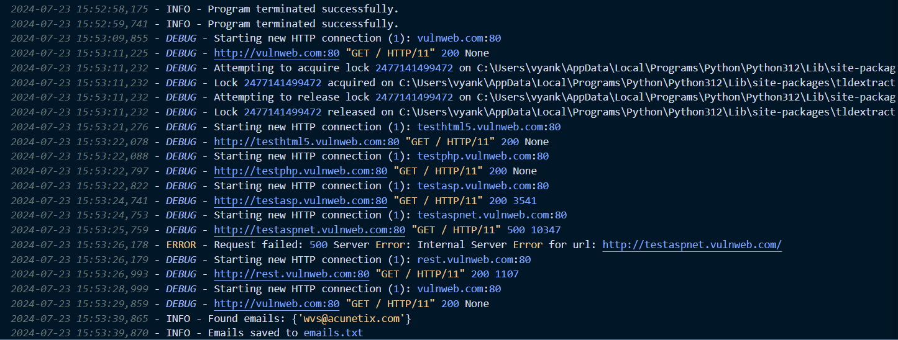

# EmailScraper

EmailScraper is a Python script designed to crawl a given website, extract email addresses, and save them to a file. The script uses a random user agent for each request to avoid detection and includes graceful termination handling. It also features a banner with ASCII art and logs activity to a file.

## Features

- Crawls a website and extracts email addresses.
- Uses a random user agent for each request to avoid detection.
- Logs activity to `program.log`.
- Graceful termination handling with `Ctrl+C`.
- Displays a banner with ASCII art.
- Saves extracted email addresses to `emails.txt`.




## Prerequisites

- Python 3.x
- Required Python libraries: `requests`, `bs4`, `tldextract`, `fake_useragent`, `colorama`

## Installation

1. Clone the repository:
    ```sh
    git clone https://github.com/kunalnamdas/EmailScraper.git
    cd EmailScraper
    ```

2. Install the required Python libraries:
    ```sh
    pip install -r requirements.txt
    ```

## Usage

1. Run the script:
    ```sh
    python EmailScraper.py
    ```

2. Enter the domain to scrape and the delay between requests when prompted:
    ```sh
    Enter the domain to scrape: example.com
    Enter the delay between requests (in seconds): 2
    ```

3. The script will crawl the specified domain, extract email addresses, and save them to `emails.txt`.

## Configuration

- **Random User Agent**: The script uses `fake_useragent` to generate a random user agent for each request.
- **Delay between requests**: Enter the delay (in seconds) between requests to avoid detection.

## Handling Interruptions

- The script handles graceful termination with `Ctrl+C`. Upon interruption, it logs a message and exits cleanly.

## Logging

- All activities, including errors and interruptions, are logged to `program.log`.

## ASCII Art Banner

- The script displays a banner with ASCII art and author information upon execution.

## Author

- **Kunal Namdas**
- GitHub: [@kunalnamdas](https://github.com/kunalnamdas)

## License

This project is licensed under the MIT License - see the [LICENSE](LICENSE) file for details.

## Contributing

Contributions are welcome! Please feel free to submit a pull request.

## Acknowledgments

- Special thanks to the developers of the libraries used in this project.

---

### Example

```sh
$ python EmailScraper.py
Enter the domain to scrape: example.com
Enter the delay between requests (in seconds): 2
[+] Crawling URL: http://example.com
Emails saved successfully!
```
